<style>
    section header {
        font-size: 30px;
        font-weight: bold;
        color: #063970;
    }

    img[alt~="center"] {
        display: block;
        margin: 0 auto;
    }

    section h1 {
        color: #063970;
    }

    section.lead h1 {
        text-align: center;
    }
</style>

<!-- _paginate: false -->
<!-- _footer: "" -->

<!-- _backgroundColor: #DBE1E2 -->
# Monads
## Pour du code fonctionnel


---
<!-- _header: Programmation functionnal -->

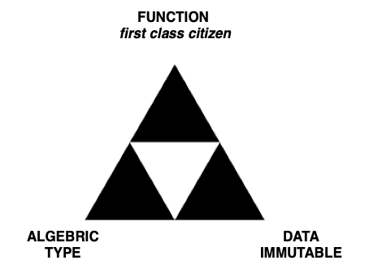

---
<!-- _header: Function: first class system -->
> function can be assign to a variable.
```typescript
type GreetFunction = (a: string) => void;
let greet: GreetFunction = (name: string) => {
    console.log("hello, {name}");
}
```
<br>

> function can be pass as parameters.
```typescript
function filter1<Type>(arr: Type[], func: (arg: Type) => boolean): Type[] {
  return arr.filter(func);
}
```

---
<!-- _header: Function: first class citizen -->

> function can be assign to a variable.
```typescript
type GreetFunction = (a: string) => void;
let greet: GreetFunction = (name: string) => {
    console.log("hello, {name}");
}
```
<br>

> function can be return.
```typescript
function middleware(powerBy: string ) => {
    return function (req: Request, res: Response, next: NextFunction): void) {
        res.setHeader('X-Power-By', powerBy);
        next();
    }
}
```

---
<!-- _header: What is a function ? -->

> In mathematics, a **function** from a set X to a set Y assigns to each element of X exactly one element of Y.

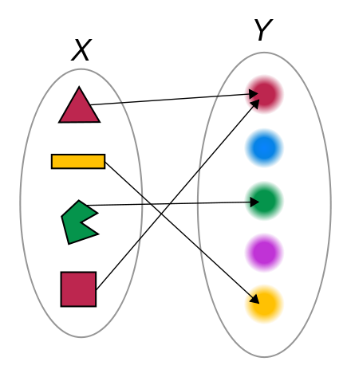

---
<!-- _header: Function for programmer -->

> can produce a error
```golang
func readFile(path string) (string, error) {...}
```

> can return underterminist value
```javascript
function rand() -> int { return Math.floor(Math.random() * 10); }
```

> can have dependencies
```javascript
let max = 12; let operations = [];
function buffer(value: Any) => void { 
    if (operations.length < max) { operations.push(value);}
    else { operations = []; }
}
```

---
<!-- _header: Function for programmer  - pure function -->


- no variation with local static variables, non-local variables, mutable reference arguments or input streams

- no side effects.

*pure function:*
```c
void f() {
  static std::atomic<unsigned int> x = 0; ++x;
}
```

*impure function:*
```c
int f() {
  static int x = 0; ++x;
  return x;
}
```

---

<!-- _paginate: false -->
<!-- _footer: "" -->
<!-- _class: lead -->

<!-- _backgroundColor: #DBE1E2 -->
# How to organize functional code ?


---
<!-- _header: Code organization in oop -->

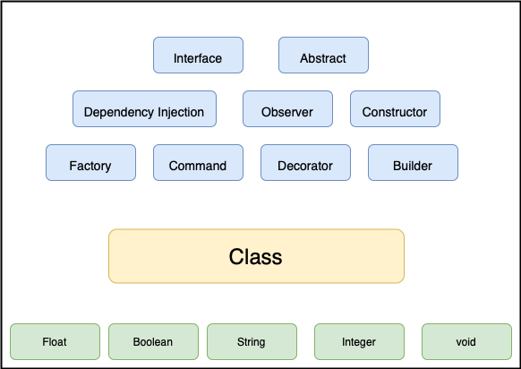

---
<!-- _header: Code organization in fp -->

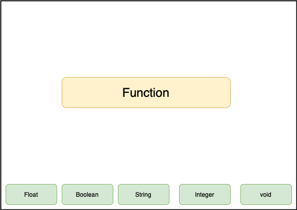


---

<!-- _paginate: false -->
<!-- _footer: "" -->
<!-- _class: lead -->

<!-- _backgroundColor: #DBE1E2 -->
# Composition

---
<!-- _header: Compostion -->

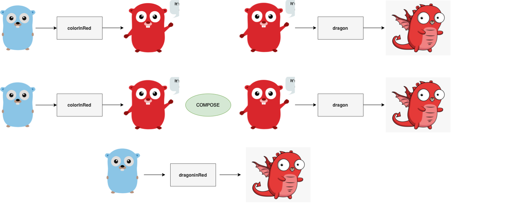


---
<!-- _header: Compostion in practice -->

```typescript
function mupl2(i: int) => int { return i * 2; }
function minus4(i: int) => int { return i - 4; }
function square(i: int) => int { return i * i; }
```
<br>

> combine function ?
```typescript
function compute(i: int) { // 2*(x^2) - 4
    return minus4(mupl2(square(x)));
}
```

---
<!-- _header: Compostion in practice -->

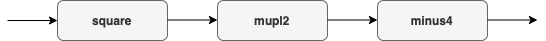

<br>

> composition as pipeline

```haskell
compute: Int -> Int 
compute =  minus4  . mupl2 . square
```

---
<!-- _header: Compostion in practice -->

> example: ***bash pipe***
```bash
cat file2.txt | sort  | uniq | head -4 > list4.txt
```

> example: ***java stream***

```javascript
List<Float> prices =products.stream()  
        .filter(p -> p.price > 30000) // filtering data  
        .map(p->p.price)              // fetching price  
        .collect(Collectors.toList()); 
```

> example: ***javascript promise***
```javascript
Promise.resolve(1).then(2).then(console.log);
```


---
<!-- _header: Compostion - Example -->

> Write a web service to update a user's  name ?

<br>


---
<!-- _header: Compostion - Example -->

> Write a web service to update a user's  name ?

<br>

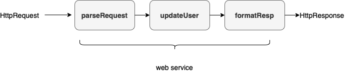

---
<!-- _header: Compostion - Example -->

> Write a web service to update a user's  name ?

<br>


```haskell
handler: HttpRequest -> HttpResponse 
compute =  parseRequest  . updateUser . formatResp
```

---

<!-- _paginate: false -->
<!-- _footer: "" -->
<!-- _class: lead -->

<!-- _backgroundColor: #DBE1E2 -->
# Failure


---
<!-- _header: Function with failure -->

> the function `parseRequest` could fail 
> How to deal with the failure ? 


- Ignore - *not a good idea !!!*
- Throw a exception - *where to `catch` ?*
- Return a `error` when its occurs - *OK* 

---
<!-- _header: Function with failure -->


the result of `parseRequest` will be:

- Success - *with the expected result*
- Error -  *with the description of why the attemp fail*

```haskell
type Result User =  User | Error
parseRequest :: HttpRquest -> Result User
```

---
<!-- _header: Function with failure -->

> the function `parseRequest` and `updateUser` are not longer composable

<br><br>


---
<!-- _header: Function with failure - Railway programming -->

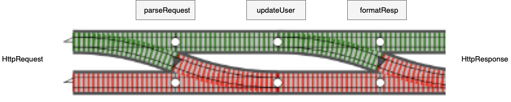

- if `parseRequest` fails, return the `error` directly.

- if `parseRequest` succeed, continue the computation.

---
<!-- _header: Function with failure - Summary -->

> define a `type constructor`:

```haskell
type Result a =  Either a  Error
```

> define a compostion operator:
```haskell
composeErr :: (a -> Result b) -> (b -> Result c) -> (a -> Result c)
```

`Result` define a `Monad` 

---
<!-- _header: Monad -->

```haskell
class Monad m where

  (>=>)  :: (a -> m b) -> (b -> m c) -> (a -> m c)

  return ::  a  -> m a

```

---

<!-- _paginate: false -->
<!-- _footer: "" -->
<!-- _class: lead -->

<!-- _backgroundColor: #DBE1E2 -->
# The 4 horsemen of (cat)apocalypse

---
<!-- _header: The 4 horsemen of (cat)apocalypse -->

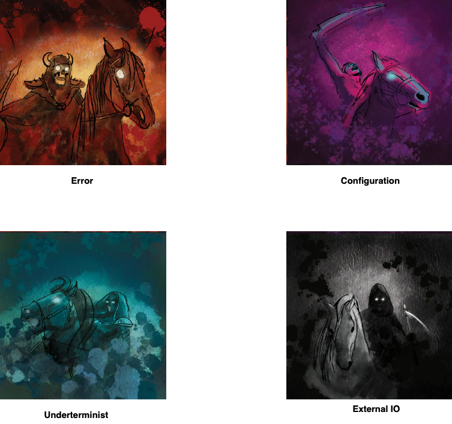

---
<!-- _header: The 4 horsemen of (cat)apocalypse -->


---
<!-- _header: Function with configuration -->

> Pure function are self contains.

> Computer program are messes of configuration. 
> Computer program depend on information that is *common knowledge*


We want the ability to pass a *configuration* to every function.
```haskell
type Config = Map String String
funWithConfig :: (a, Config) -> b 
```

---
<!-- _header: Function with configuration- Composition -->

> What about composition ? 

<br><br>

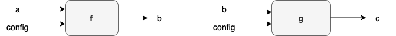


---
<!-- _header: Function with configuration - curry lemma -->

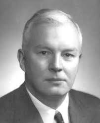

> **currying** is the technique of translating the evaluation of a function that takes multiple arguments into evaluating a sequence of functions, each with a single argument.

```haskell
div :: (Int, Int) -> Int

divBy :: Int -> (Int -> Int)
divBy y = \x -> div x y 

//conclusion

div x y = (divBy y) $ x

```

---
<!-- _header: Function with configuration -->

We want the ability to pass a *configuration* to every function.
```haskell
type Config = Map String String
funWithConfig :: (a, Config) -> b 
```

With **currying** operation
```haskell
funWithConfig :: a -> (Config -> b) 
```

```haskell
type Pref b = (Config -> b)
funWithConfig :: a -> Pref b
```

---
<!-- _header: Function with configuration - Composition -->

> What about composition ? 

<br>


- apply the first function with first parameter `a` and `config` to obtain a value of `b`

- apply the second function with the value of `b` and `config` to obtain a value of `c`

---
<!-- _header: Function with configuration - Summary -->

> define a `type constructor`:

```haskell
type Pref b = (Config -> b)
```

> define a compostion operator:
```haskell
composePref :: (a -> Pref b) -> (b -> Pref c) -> (a -> Pref c)
```

`Pref` define a `Monad` 

---
<!-- _header: The 4 horsemen of (cat)apocalypse -->

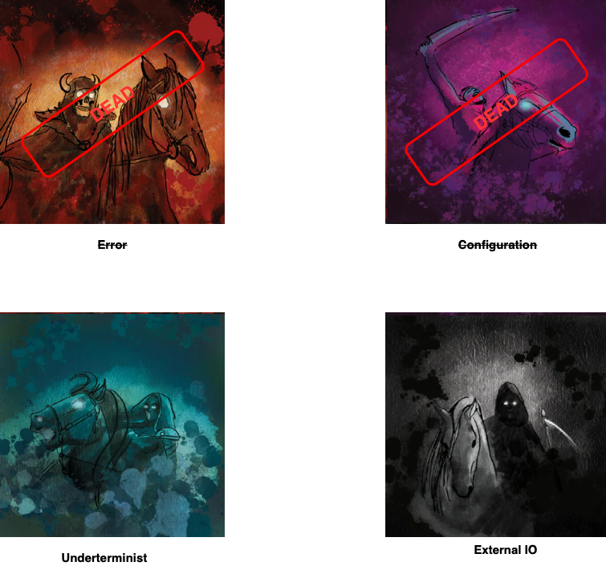

---
<!-- _header: Uncertain function -->

> a pure function associate each input to *one* output

> a non determinist function associate each input to *some number of possibles outputs.*
> eg random, parsing, querying ....

Represent the *possibles outputs* as a `List.`

```haskell
type Possibility b = [b]
nonDeterminist :: a -> Possibility b 
```

---
<!-- _header: Uncertain function - composition -->

> What about composition ?

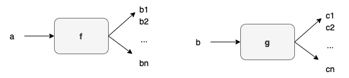


 - apply the first function `f`.

 - apply the seconf function `g` to each output of `f`.


---
<!-- _header: Uncertain function - summary -->

> define a `type constructor`:

```haskell
type Possibility b = [b]
```

> define a compostion operator:
```haskell
composePossibility :: (a -> Possibility b) -> (b -> Possibility c) -> (a -> Possibility c)
```

`Possibility` define a `Monad` 

---
<!-- _header: The 4 horsemen of (cat)apocalypse -->

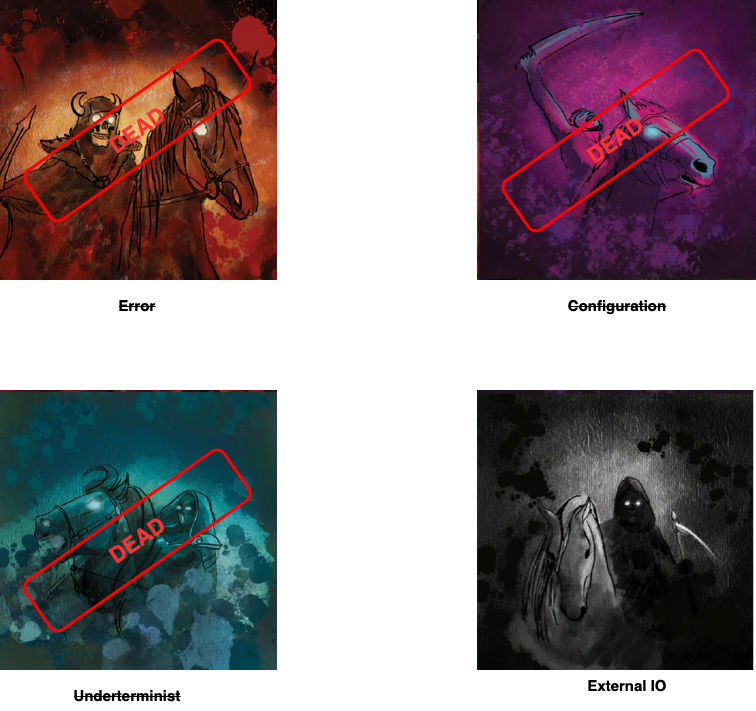


---

<!-- _paginate: false -->
<!-- _footer: "" -->
<!-- _class: lead -->

<!-- _backgroundColor: #DBE1E2 -->
# Summary


---
<!-- _header: Summary -->

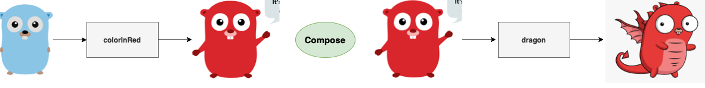

> Let's start with two  composable function.
> Unfortunately, this functions produce *side-effect*.

---
<!-- _header: Summary -->

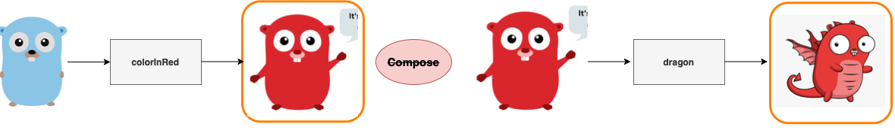

> To deal with side-effect, we need to wrap the return value into  a new *type construtor.*
> The functions are not longer *composable*.

---
<!-- _header: Summary -->

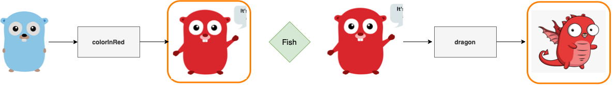

> To preserve the *composability*, we define a new *operator*.
> The *fish* operator.

---
<!-- _header: Summary -->

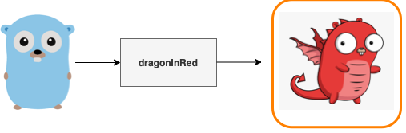

>  Function (with side-effect) are compsable again.
> The *fish* operator define a *monad*.


---
<!-- _paginate: false -->
<!-- _footer: "" -->


# Question(s) ? 
<!-- backgroundColor: #DBE1E2  -->
